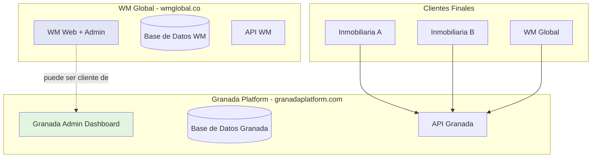
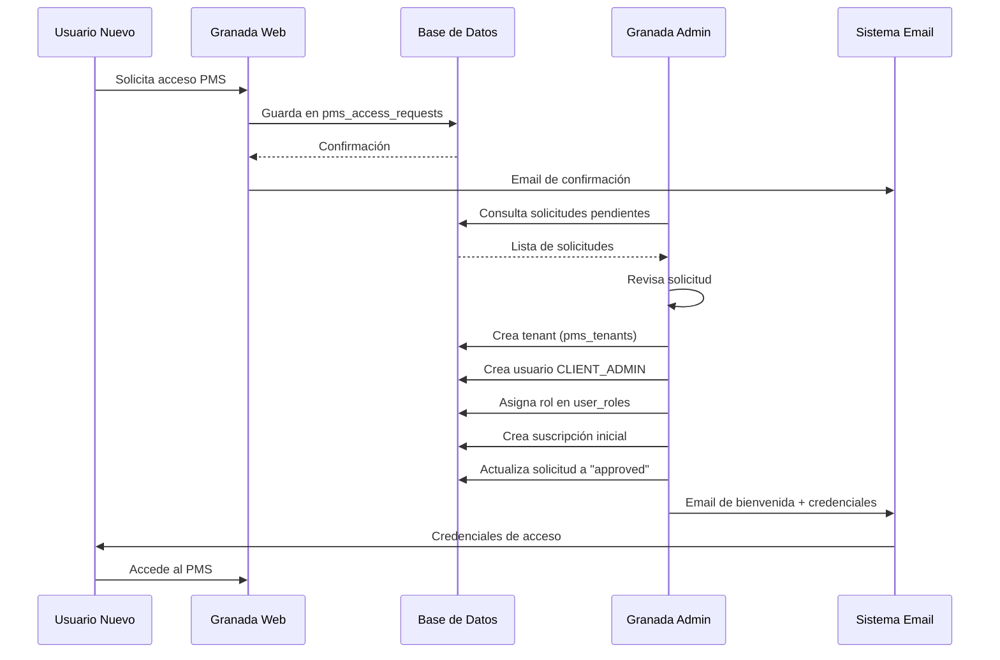

# Arquitectura Granada PMS vs WM Global

## Resumen Ejecutivo

Este documento describe la separación arquitectónica entre **Granada Platform** (proveedor SaaS) y **WM Global** (cliente/suscriptor), estableciendo claramente los roles, responsabilidades y flujos de cada sistema.

## 1. Estructura General



## 2. Granada Platform (Proveedor SaaS)

### Dominio
- **URL Principal**: `www.granadaplatform.com`
- **Admin Panel**: `www.granadaplatform.com/granada-admin`

### Responsabilidades

1. **Gestión de Clientes Suscriptores**
   - Crear y administrar tenants (inmobiliarias, administradores)
   - Gestionar usuarios CLIENT_ADMIN, PROPIETARIO, INQUILINO
   - Administrar jerarquías organizacionales

2. **Gestión de Suscripciones y Planes**
   - Definir planes de suscripción (Basic, Pro, Enterprise)
   - Administrar límites y features por plan
   - Procesar upgrades/downgrades
   - Tracking de uso y límites

3. **Facturación y Pagos**
   - Generar facturas mensuales/anuales
   - Procesar pagos
   - Tracking de MRR/ARR
   - Gestionar morosidad

4. **Analytics y Monitoreo**
   - Dashboard de KPIs (MRR, ARR, Churn Rate)
   - Alertas automáticas (cancelaciones, caída MRR)
   - Proyecciones anuales
   - Análisis de retención

5. **Aprobación de Solicitudes**
   - Revisar solicitudes de nuevos clientes
   - Crear tenant + usuario CLIENT_ADMIN
   - Asignar suscripción inicial
   - Enviar emails de bienvenida

### Roles de Usuario en Granada

| Rol | Descripción | Permisos |
|-----|-------------|----------|
| `GRANADA_ADMIN` | Administrador de la plataforma | Acceso completo a Granada Admin |
| `GRANADA_SUPPORT` | Soporte técnico | Ver datos, no modificar críticos |
| `GRANADA_FINANCE` | Equipo financiero | Gestión de pagos y facturas |

### Módulos del Admin Panel

```
/granada-admin
├── /analytics              # Dashboard de analítica
├── /subscription-requests  # 🆕 Aprobación de solicitudes
├── /clients               # Gestión de clientes
├── /client-users          # Usuarios de clientes
├── /platform-users        # Usuarios Granada
├── /subscription-plans    # Planes de suscripción
├── /subscriptions         # Suscripciones activas
└── /payments              # Historial de pagos
```

## 3. WM Global (Cliente Suscriptor)

### Dominio
- **URL Principal**: `www.wmglobal.co`
- **Admin Panel**: `www.wmglobal.co/admin`

### Responsabilidades

1. **Servicios de Real Estate**
   - Web corporativa con servicios financieros
   - Simuladores de crédito hipotecario
   - Asesoría de inversión
   - Información de propiedades

2. **Administración Interna WM**
   - Contact submissions (formularios web)
   - Simulaciones guardadas
   - Financing applications
   - AI Chatbot para atención

3. **Gestión de Usuarios WM**
   - User approvals (usuarios web WM)
   - Admin users (administradores WM)

4. **Relación con Granada** (Opcional)
   - WM puede ser cliente de Granada PMS
   - Usar el PMS para gestionar propiedades de WM
   - Facturación como cualquier otro cliente

### Roles de Usuario en WM

| Rol | Descripción | Permisos |
|-----|-------------|----------|
| `admin` | Administrador WM básico | Acceso a WM Front |
| `superadmin` | Superadministrador WM | Acceso completo + Link a Granada Admin |

### Módulos del Admin Panel

```
/admin
├── /contacts      # Submissions del sitio web
├── /simulations   # Simulaciones guardadas
├── /applications  # Solicitudes de financiamiento
├── /chatbot       # Configuración AI Chatbot
├── /approvals     # Aprobaciones de usuarios WM
└── /admin-users   # Usuarios administradores WM
```

## 4. Flujo de Suscripción de Nuevos Clientes



## 5. Tablas Clave y Separación de Datos

### Granada Platform - Tablas Principales

| Tabla | Descripción | Uso |
|-------|-------------|-----|
| `pms_tenants` | Clientes suscriptores | Inmobiliarias, administradores |
| `pms_access_requests` | Solicitudes nuevas | Flujo de aprobación |
| `user_roles` | Roles y permisos | CLIENT_ADMIN, PROPIETARIO, INQUILINO |
| `subscription_plans` | Planes disponibles | Basic, Pro, Enterprise |
| `pms_tenant_subscriptions` | Suscripciones activas | Estado, fechas, plan |
| `subscription_invoices` | Facturas | Cobros mensuales/anuales |
| `subscription_payments` | Pagos recibidos | Tracking de ingresos |
| `subscription_change_history` | Historial cambios | Upgrades, downgrades, cancelaciones |
| `subscription_alerts` | Alertas automáticas | Churn, MRR, cancelaciones |

### WM Global - Tablas Principales

| Tabla | Descripción | Uso |
|-------|-------------|-----|
| `contact_submissions` | Formularios web | Consultas de clientes |
| `simulation_scenarios` | Simulaciones | Créditos hipotecarios |
| `financing_applications` | Solicitudes | Financiamiento inmobiliario |
| `users` (module: WM) | Usuarios WM | Autenticación web WM |

## 6. Migración Completada

### Componentes Eliminados de WM Admin ❌

```
src/components/admin/
├── PMSTenantsView.tsx          ❌ ELIMINADO
├── PMSUsersAndRolesView.tsx    ❌ ELIMINADO
└── PMSAccessView.tsx           ❌ ELIMINADO

src/components/
├── PMSTenantsManagement.tsx    ❌ ELIMINADO
├── PMSUsersManagement.tsx      ❌ ELIMINADO
├── PMSRolesManagement.tsx      ❌ ELIMINADO
└── PMSAccessRequests.tsx       ❌ ELIMINADO
```

### Componentes Nuevos en Granada Admin ✅

```
src/components/granada/
├── ClientsManagement.tsx                    ✅ Reemplazo de PMSTenantsManagement
├── ClientUsersManagement.tsx                ✅ Reemplazo de PMSUsersManagement
├── SubscriptionRequestsManagement.tsx       ✅ NUEVO - Reemplazo de PMSAccessRequests
├── SubscriptionsManagement.tsx              ✅ Gestión de suscripciones
├── PaymentsManagement.tsx                   ✅ Gestión de pagos
├── SubscriptionPlansManagement.tsx          ✅ Gestión de planes
└── GranadaSubscriptionAnalyticsDashboard.tsx ✅ Analytics + Alertas
```

### Rutas Actualizadas

**WM Admin (`/admin`)**
```typescript
// ❌ ELIMINADAS
/subscription-requests
/invoices
/pms-licenses
/pms-plans
/pms-tenants
/pms-access
/pms-users-roles

// ✅ MANTENIDAS
/contacts
/simulations
/applications
/chatbot
/approvals
/admin-users
```

**Granada Admin (`/granada-admin`)**
```typescript
// ✅ TODAS DISPONIBLES
/analytics
/subscription-requests  // 🆕 NUEVO
/clients
/client-users
/platform-users
/subscription-plans
/subscriptions
/payments
```

## 7. Navegación Entre Sistemas

### Desde WM Admin → Granada Admin
- **Solo para `superadmin`**
- Botón "Granada Admin" en header
- Redirección a `/granada-admin`

### Desde Granada Admin → PMS
- Dropdown de usuario
- Opción "Ir al PMS"
- Redirección a `/pms`

## 8. Autenticación y Seguridad

### Granada Admin
- Usuarios con rol `GRANADA_ADMIN` en `user_roles`
- Context: `GranadaAuthContext`
- Tabla: `user_roles` (module: 'GRANADA')

### WM Admin
- Usuarios con rol `admin` o `superadmin` en `user_roles`
- Context: `AuthContext`
- Tabla: `user_roles` (module: 'WM')

### PMS (Cliente)
- Usuarios con roles: `CLIENT_ADMIN`, `STAFF`, `PROPIETARIO`, `INQUILINO`
- Context: `PMSContext`
- Tabla: `user_roles` (module: 'PMS')

## 9. Modelo de Negocio

### Granada Platform (B2B SaaS)
- **Clientes**: Inmobiliarias, administradores de propiedades
- **Ingresos**: Suscripciones mensuales/anuales
- **Modelo**: Freemium → Basic → Pro → Enterprise
- **Facturación**: Automatizada por tenant

### WM Global (B2C + B2B)
- **Servicios**: Real Estate, Financiamiento, Asesoría
- **Relación con Granada**: Puede ser cliente del PMS (opcional)
- **Ingresos**: Comisiones, asesorías, servicios

## 10. Escalabilidad y Futuro

### Granada Platform puede:
- Agregar más clientes suscriptores
- Expandir planes (Custom, White Label)
- Ofrecer APIs para integraciones
- Multi-región / Multi-idioma

### WM Global puede:
- Mantener su web de servicios independiente
- Usar Granada PMS para su operación
- No depender del PMS si no lo necesita
- Expandir sus servicios financieros

## 11. Conclusiones

✅ **Separación clara de responsabilidades**
✅ **Granada = Proveedor SaaS PMS**
✅ **WM = Cliente + Servicios Real Estate**
✅ **Arquitectura escalable y mantenible**
✅ **Flujos de aprobación automatizados**
✅ **Analytics y alertas para Granada**
✅ **Independencia operacional de ambos sistemas**

---

**Última actualización**: 2025-11-13
**Versión**: 1.0
**Autor**: Granada Platform Team
