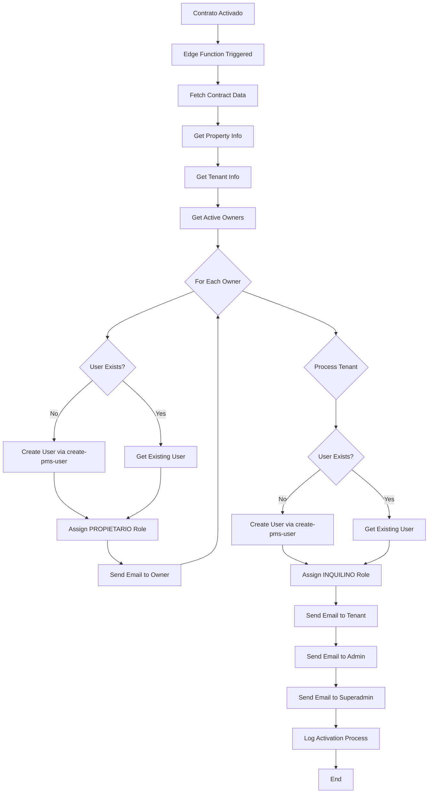
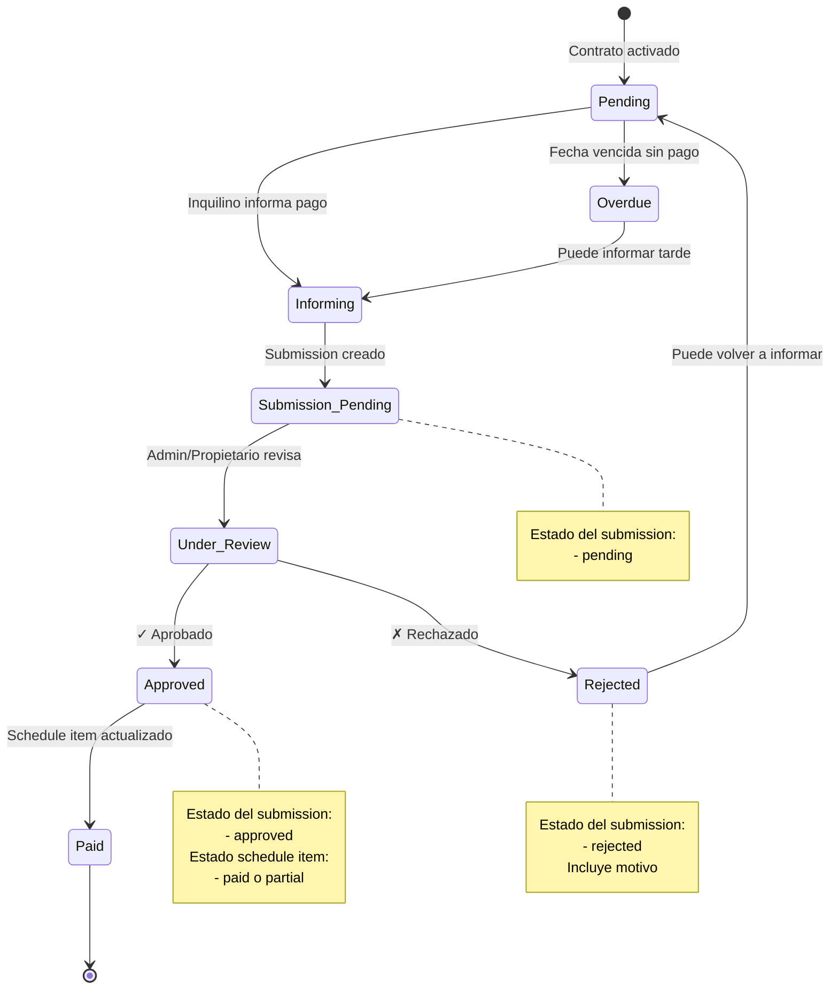
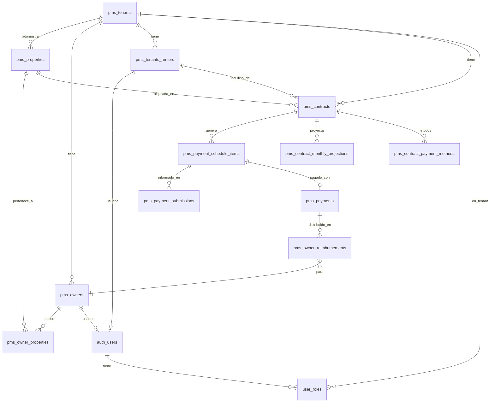
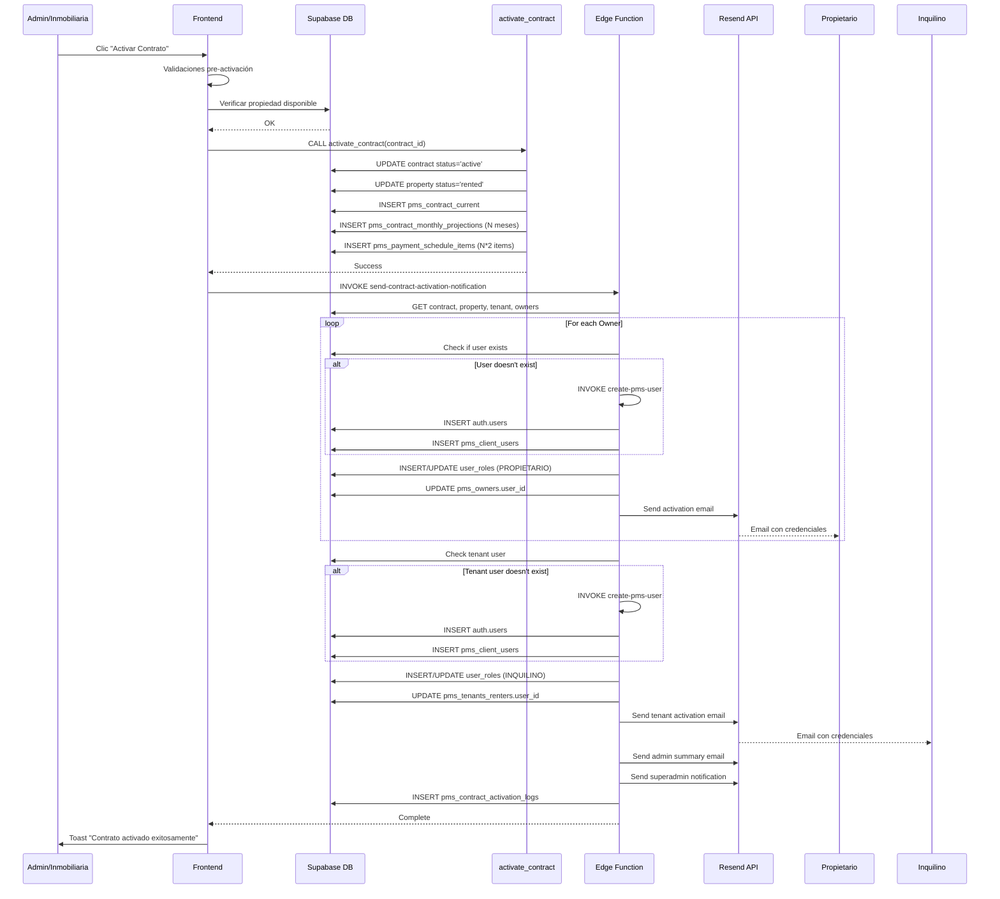
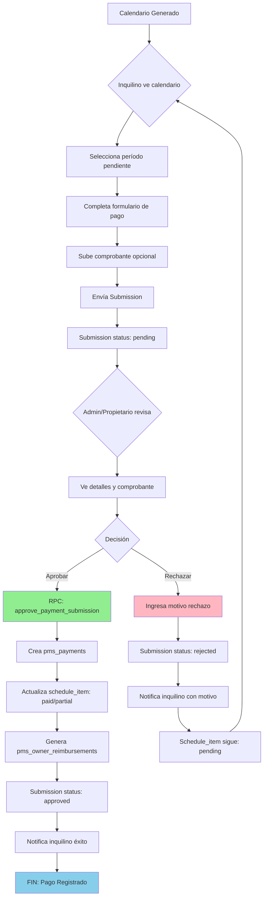
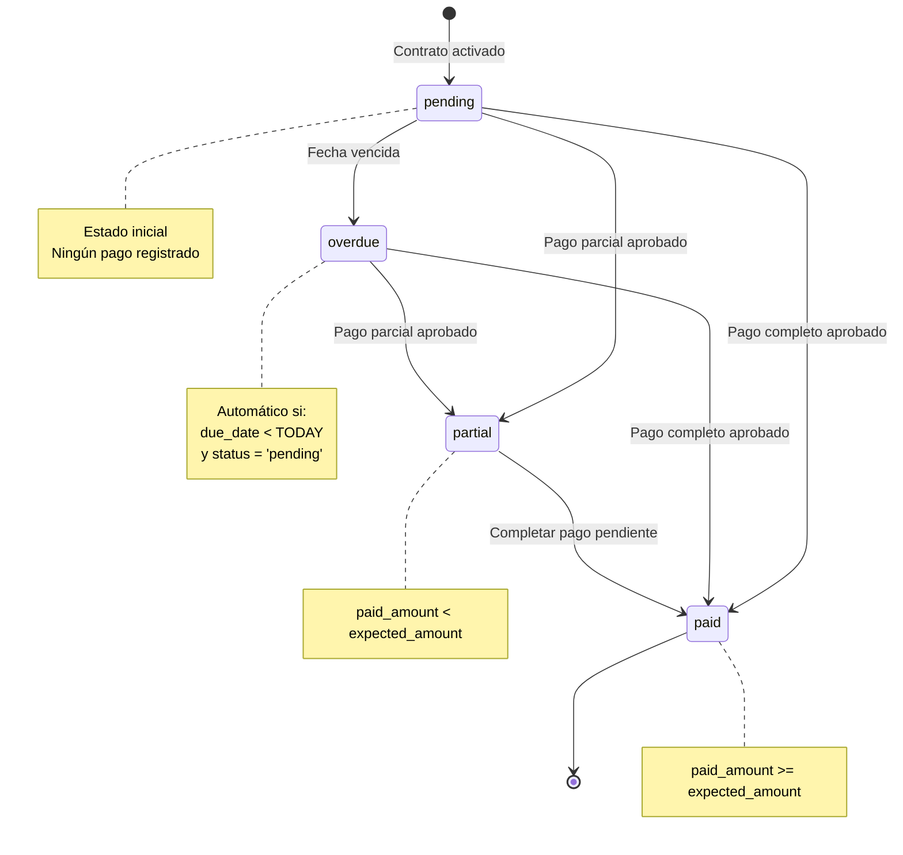
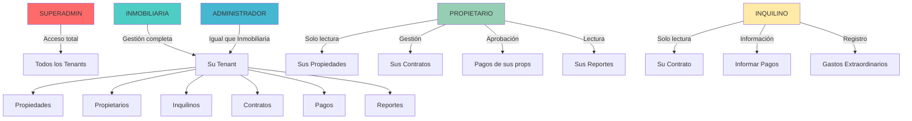

# Flujo Completo de Contrato de Alquiler - Granada PMS

## Tabla de Contenidos
1. [Prerrequisitos y Dependencias](#prerrequisitos-y-dependencias)
2. [Creación del Contrato](#creación-del-contrato)
3. [Activación del Contrato](#activación-del-contrato)
4. [Sistema de Notificaciones Automáticas](#sistema-de-notificaciones-automáticas)
5. [Acceso a Portales](#acceso-a-portales)
6. [Flujo Completo de Pagos](#flujo-completo-de-pagos)
7. [Diagramas de Referencia](#diagramas-de-referencia)

---

## Prerrequisitos y Dependencias

Antes de crear un contrato de alquiler, es necesario completar las siguientes entidades en el sistema:

### 1. Crear Propietario (pms_owners)

**Tabla:** `pms_owners`

**Campos requeridos:**
- `full_name`: Nombre completo del propietario
- `email`: Correo electrónico (único)
- `phone`: Teléfono de contacto
- `document_id`: DNI/CUIT/CUIL
- `address`: Dirección del propietario
- `tenant_id`: ID del tenant de la inmobiliaria
- `is_active`: true (por defecto)

**Campos opcionales:**
- `bank_account`: Cuenta bancaria para transferencias
- `cbu_cvu`: CBU/CVU para pagos electrónicos
- `alias`: Alias bancario
- `tax_id`: CUIT para facturación
- `notes`: Notas adicionales

**Proceso:**
1. El administrador ingresa a `/pms/owners`
2. Completa el formulario de nuevo propietario
3. El sistema valida email único
4. Se crea el registro en `pms_owners`
5. **Importante:** En este punto NO se crea usuario de acceso automáticamente

### 2. Crear Propiedad (pms_properties)

**Tabla:** `pms_properties`

**Campos requeridos:**
- `name`: Nombre identificatorio de la propiedad
- `address`: Dirección completa
- `city`: Ciudad
- `province`: Provincia
- `country`: País
- `property_type`: Tipo (departamento, casa, local, etc.)
- `tenant_id`: ID del tenant de la inmobiliaria

**Campos opcionales:**
- `neighborhood`: Barrio
- `zip_code`: Código postal
- `surface_total`: Superficie total (m²)
- `surface_covered`: Superficie cubierta (m²)
- `rooms`: Cantidad de ambientes
- `bedrooms`: Cantidad de dormitorios
- `bathrooms`: Cantidad de baños
- `amenities`: Amenidades (array)
- `notes`: Notas adicionales
- `photos`: Fotos de la propiedad (array de URLs)

**Estado inicial:**
- `status`: "available" (disponible)
- `is_automatic_status`: true (el estado se actualiza automáticamente según contratos)

**Proceso:**
1. El administrador ingresa a `/pms/properties`
2. Completa el formulario de nueva propiedad
3. Puede subir fotos (hasta 10 imágenes)
4. El sistema crea la propiedad con estado "available"

### 3. Vincular Propietario con Propiedad (pms_owner_properties)

**Tabla:** `pms_owner_properties`

**Campos requeridos:**
- `owner_id`: ID del propietario
- `property_id`: ID de la propiedad
- `ownership_percentage`: Porcentaje de propiedad (0-100)
- `start_date`: Fecha de inicio de propiedad
- `tenant_id`: ID del tenant

**Campos opcionales:**
- `end_date`: Fecha de fin (null si es propietario actual)
- `notes`: Notas sobre la propiedad

**Reglas:**
- La suma de `ownership_percentage` para una propiedad debe ser 100%
- Se permiten múltiples propietarios por propiedad
- Las fechas no pueden superponerse para el mismo propietario

**Proceso:**
1. Desde el detalle de la propiedad, clic en "Gestionar Propietarios"
2. Seleccionar propietario existente o crear uno nuevo
3. Definir porcentaje de propiedad
4. Establecer fecha de inicio
5. El sistema valida que el total no supere 100%

### 4. Crear Inquilino (pms_tenants_renters)

**Tabla:** `pms_tenants_renters`

**Campos requeridos:**
- `full_name`: Nombre completo del inquilino
- `email`: Correo electrónico (único)
- `phone`: Teléfono de contacto
- `document_id`: DNI/CUIT/CUIL
- `tenant_id`: ID del tenant de la inmobiliaria
- `is_active`: true

**Campos opcionales:**
- `address`: Dirección actual
- `occupation`: Ocupación/profesión
- `employer`: Empleador
- `monthly_income`: Ingreso mensual
- `emergency_contact_name`: Contacto de emergencia
- `emergency_contact_phone`: Teléfono de emergencia
- `notes`: Notas adicionales

**Proceso:**
1. El administrador ingresa a `/pms/tenants`
2. Completa el formulario de nuevo inquilino
3. El sistema valida email único
4. Se crea el registro en `pms_tenants_renters`
5. **Importante:** En este punto NO se crea usuario de acceso automáticamente

---

## Creación del Contrato

### Formulario de Contrato (`/pms/contracts`)

**Tabla principal:** `pms_contracts`

#### Sección 1: Información Básica

**Campos:**
- `contract_number`: Número único de contrato (autogenerado)
- `property_id`: Selección de propiedad (solo propiedades disponibles)
- `tenant_id`: ID del inquilino
- `start_date`: Fecha de inicio del contrato
- `end_date`: Fecha de fin del contrato
- `duration_months`: Duración en meses (calculado automáticamente)

**Validaciones:**
- La propiedad debe estar en estado "available" o "inactive"
- No puede haber superposición de fechas con otros contratos activos de la misma propiedad
- `end_date` debe ser posterior a `start_date`

#### Sección 2: Configuración Financiera

**Monto A (Alquiler):**
- `amount_a`: Monto del alquiler base
- `currency_a`: Moneda (ARS, USD, etc.)
- `item_a_label`: Etiqueta personalizada (default: "Alquiler")

**Monto B (Expensas/Servicios):**
- `amount_b`: Monto de expensas (opcional)
- `currency_b`: Moneda (ARS, USD, etc.)
- `item_b_label`: Etiqueta personalizada (default: "Expensas")

**Configuración de Ajustes:**
- `adjustment_type`: Tipo de ajuste (ICL, IPC, Casa Propia, etc.)
- `adjustment_frequency_months`: Frecuencia de ajuste (3, 6, 12 meses)
- `aplica_a_items`: A qué items se aplica ("A", "B", "A+B")

**Depósito y Garantía:**
- `deposit_amount`: Monto de depósito
- `deposit_currency`: Moneda del depósito
- `guarantee_type`: Tipo de garantía (propietaria, seguro de caución, bancaria)

**Día de Vencimiento:**
- `payment_due_day`: Día del mes para vencimiento de pagos (1-31)

#### Sección 3: Distribución de Pagos

**Tabla:** `pms_contract_payment_methods`

Para cada item (A y/o B), se puede configurar:
- `payment_method`: Método de pago (transferencia, efectivo, depósito)
- `destination_account`: Cuenta destino (CBU/Alias)
- `percentage`: Porcentaje del monto (si hay múltiples propietarios)
- `notes`: Notas adicionales

**Regla:** La suma de porcentajes por item debe ser 100%

#### Sección 4: Documentos del Contrato

**Storage bucket:** `contract_documents`

**Tipos de documentos soportados:**
- Contrato firmado (PDF)
- DNI del inquilino
- Garantía propietaria (escritura)
- Certificado de seguro
- Otros documentos relevantes

**Estructura de almacenamiento:**
```
contract_documents/
  └── {tenant_id}/
      └── {contract_id}/
          ├── contrato_firmado.pdf
          ├── dni_inquilino.pdf
          └── garantia.pdf
```

#### Estado Inicial del Contrato

Al crear el contrato:
- `status`: "draft" (borrador)
- `created_by`: ID del usuario que creó el contrato
- `created_at`: Timestamp de creación

**Estados posibles:**
1. `draft`: Borrador, puede editarse
2. `active`: Activo, generando pagos
3. `completed`: Finalizado
4. `cancelled`: Cancelado antes de tiempo

---

## Activación del Contrato

### Validaciones Pre-Activación

Antes de activar un contrato, el sistema verifica:

1. **Propiedad disponible:**
   - Hook: `useContractValidation.ts`
   - Verifica que no haya contratos activos superpuestos en fechas
   - Excepción: permite renovaciones secuenciales (el nuevo contrato inicia al día siguiente del anterior)

2. **Datos completos:**
   - Todos los campos obligatorios completados
   - Al menos un método de pago configurado
   - Porcentajes de distribución suman 100%

3. **Validación de fechas:**
   - `start_date` no puede ser anterior a hoy
   - `end_date` posterior a `start_date`
   - Duración coherente con tipo de contrato

### Proceso de Activación

**Componente:** `ActivateContractDialog.tsx`

#### Paso 1: Usuario Confirma Activación

```typescript
// El administrador hace clic en "Activar Contrato"
// Se muestra diálogo de confirmación con:
- Número de contrato
- Fechas de vigencia
- Monto total mensual
- Advertencia: "Esta acción generará el calendario de pagos y notificará a todas las partes"
```

#### Paso 2: Verificación de Propiedad

```typescript
// Si la propiedad está en estado "inactive", se reactiva automáticamente
const { data: property } = await supabase
  .from('pms_properties')
  .select('status')
  .eq('id', propertyId)
  .single();

if (property.status === 'inactive') {
  await supabase
    .from('pms_properties')
    .update({ status: 'available' })
    .eq('id', propertyId);
}
```

#### Paso 3: Llamada a RPC `activate_contract`

**Función de base de datos:** `activate_contract(p_contract_id UUID)`

**Operaciones realizadas:**

1. **Actualiza estado del contrato:**
   ```sql
   UPDATE pms_contracts 
   SET status = 'active',
       activated_at = NOW(),
       activated_by = auth.uid()
   WHERE id = p_contract_id;
   ```

2. **Actualiza estado de la propiedad:**
   ```sql
   UPDATE pms_properties 
   SET status = 'rented',
       is_automatic_status = TRUE
   WHERE id = (SELECT property_id FROM pms_contracts WHERE id = p_contract_id);
   ```

3. **Genera registro en `pms_contract_current`:**
   - Tabla que mantiene los montos actuales del contrato
   - `current_amount`: Monto A + Monto B actual
   - `current_item_a`: Monto A actual
   - `current_item_b`: Monto B actual
   - `next_adjustment_date`: Primera fecha de ajuste
   - `current_from`: Fecha de inicio del período actual

4. **Genera proyecciones mensuales (`pms_contract_monthly_projections`):**
   - Una fila por mes de duración del contrato
   - Para cada item (A y B si aplica)
   - Incluye `base_amount` y `adjusted_amount` (con ajustes proyectados)
   - `month_number`: Número de mes desde inicio (1, 2, 3...)
   - `period_date`: Fecha del período (YYYY-MM-01)
   - `pending_indices`: TRUE si necesita índices para calcular ajuste

5. **Genera calendario de pagos (`pms_payment_schedule_items`):**
   
   Para cada mes de vigencia del contrato:
   
   **Item tipo "Alquiler":**
   ```typescript
   {
     contract_id: contract.id,
     tenant_id: contract.tenant_id,
     due_date: 'YYYY-MM-DD', // Día de vencimiento configurado
     item: 'Alquiler', // o label personalizado
     amount: current_amount_a,
     currency: contract.currency_a,
     status: 'pending',
     type: 'rent'
   }
   ```
   
   **Item tipo "Expensas"** (si aplica):
   ```typescript
   {
     contract_id: contract.id,
     tenant_id: contract.tenant_id,
     due_date: 'YYYY-MM-DD', // mismo día de vencimiento
     item: 'Expensas', // o label personalizado
     amount: current_amount_b,
     currency: contract.currency_b,
     status: 'pending',
     type: 'expense'
   }
   ```
   
   **Estados de schedule items:**
   - `pending`: Pendiente de pago
   - `partial`: Parcialmente pagado
   - `paid`: Pagado completamente
   - `overdue`: Vencido (automático si pasa la fecha)

6. **Trigger de notificaciones:**
   - Al finalizar, dispara edge function `send-contract-activation-notification`

---

## Sistema de Notificaciones Automáticas

**Edge Function:** `supabase/functions/send-contract-activation-notification/index.ts`

Esta función se ejecuta automáticamente tras la activación del contrato y gestiona la creación de usuarios y envío de notificaciones.

### Flujo General



### 1. Notificaciones a Propietarios

**Para cada propietario activo de la propiedad:**

#### Paso A: Verificar Usuario Existente

```typescript
const { data: existingUser } = await supabase
  .from('pms_client_users')
  .select('user_id, email')
  .eq('email', owner.email)
  .eq('tenant_id', tenantId)
  .eq('user_type', 'PROPIETARIO')
  .single();
```

#### Paso B: Crear Usuario (si no existe)

**Invoca:** `create-pms-user` edge function

```typescript
const { data: newUserData } = await supabase.functions.invoke('create-pms-user', {
  body: {
    email: owner.email,
    first_name: owner.full_name.split(' ')[0],
    last_name: owner.full_name.split(' ').slice(1).join(' '),
    company_name: null // persona física
  }
});

// Retorna:
// - user_id: UUID del usuario creado en auth.users
// - temp_password: Contraseña temporal generada
```

**Operaciones en `create-pms-user`:**
1. Genera contraseña temporal: `crypto.randomUUID().substring(0, 12)`
2. Crea usuario en `auth.users` con:
   - `email`: Email del propietario
   - `password`: Contraseña temporal
   - `email_confirm`: true (pre-confirmado)
   - `user_metadata`: { first_name, last_name, entity_type: 'persona' }
3. Retorna `user_id` y `temp_password`

#### Paso C: Crear Registro en `pms_client_users`

```typescript
await supabase
  .from('pms_client_users')
  .insert({
    user_id: newUserData.user_id,
    tenant_id: tenantId,
    email: owner.email,
    first_name: firstName,
    last_name: lastName,
    user_type: 'PROPIETARIO',
    owner_id: owner.id,
    is_active: true,
    created_by: auth.uid()
  });
```

#### Paso D: Asignar Rol PROPIETARIO

```typescript
const { data: existingRole } = await supabase
  .from('user_roles')
  .select('id')
  .eq('user_id', userId)
  .eq('tenant_id', tenantId)
  .eq('module', 'PMS')
  .eq('role', 'PROPIETARIO')
  .single();

if (!existingRole) {
  await supabase
    .from('user_roles')
    .insert({
      user_id: userId,
      tenant_id: tenantId,
      module: 'PMS',
      role: 'PROPIETARIO',
      status: 'approved' // Pre-aprobado automáticamente
    });
}
```

#### Paso E: Actualizar `owner_id` en `pms_owners`

```typescript
await supabase
  .from('pms_owners')
  .update({ user_id: userId })
  .eq('id', owner.id);
```

#### Paso F: Enviar Email al Propietario

**Servicio:** Resend (vía API key en secrets)

**Template para usuario NUEVO:**

```
Asunto: Contrato Activado - Acceso al Portal Granada PMS

Estimado/a [Nombre Propietario],

El contrato de alquiler de su propiedad ha sido activado:

📋 Detalles del Contrato:
- Número: [Contract Number]
- Propiedad: [Property Address]
- Inquilino: [Tenant Name]
- Período: [Start Date] - [End Date]
- Monto Mensual: [Currency] [Total Amount]

🔐 Credenciales de Acceso al Portal:
- URL: https://wm-vision-hub.lovable.app/pms/login
- Usuario: [owner.email]
- Contraseña Temporal: [temp_password]

⚠️ Por favor, cambie su contraseña al primer ingreso.

📊 En su portal podrá:
- Ver el calendario de pagos
- Revisar y aprobar pagos informados por el inquilino
- Acceder a reportes mensuales automáticos
- Gestionar información de sus propiedades

Saludos,
Equipo Granada PMS
```

**Template para usuario EXISTENTE:**

```
Asunto: Nuevo Contrato Activado - Granada PMS

Estimado/a [Nombre Propietario],

Se ha activado un nuevo contrato de alquiler de su propiedad:

📋 Detalles del Contrato:
- Número: [Contract Number]
- Propiedad: [Property Address]
- Inquilino: [Tenant Name]
- Período: [Start Date] - [End Date]
- Monto Mensual: [Currency] [Total Amount]

Puede ver los detalles en su portal:
https://wm-vision-hub.lovable.app/pms/login

Saludos,
Equipo Granada PMS
```

### 2. Notificación al Inquilino

**Proceso idéntico al de propietarios, con diferencias:**

#### Diferencias Clave:

1. **Rol asignado:** `INQUILINO` (en lugar de PROPIETARIO)

2. **Registro en `pms_client_users`:**
   ```typescript
   {
     user_type: 'INQUILINO',
     contract_id: contract.id, // Vinculado al contrato
     owner_id: null
   }
   ```

3. **Actualización de `pms_tenants_renters`:**
   ```typescript
   await supabase
     .from('pms_tenants_renters')
     .update({ user_id: userId })
     .eq('id', tenantId);
   ```

4. **Email Template:**

```
Asunto: Contrato de Alquiler Activado - Acceso al Portal

Estimado/a [Nombre Inquilino],

Su contrato de alquiler ha sido activado en Granada PMS:

📋 Detalles del Contrato:
- Número: [Contract Number]
- Propiedad: [Property Address]
- Período: [Start Date] - [End Date]
- Monto Mensual: [Currency] [Total Amount]
- Día de Vencimiento: [Payment Due Day]

🔐 Credenciales de Acceso al Portal:
- URL: https://wm-vision-hub.lovable.app/pms/login
- Usuario: [tenant.email]
- Contraseña Temporal: [temp_password]

⚠️ Por favor, cambie su contraseña al primer ingreso.

📊 En su portal podrá:
- Ver el calendario de pagos pendientes
- Informar pagos realizados con comprobantes
- Registrar gastos extraordinarios
- Ver historial de pagos

💡 Recuerde informar cada pago con su respectivo comprobante para agilizar la aprobación.

Saludos,
Equipo Granada PMS
```

### 3. Notificación al Admin de la Inmobiliaria

**Destinatario:** Usuario con rol `CLIENT_ADMIN` del tenant

```
Asunto: [Granada PMS] Contrato Activado - [Contract Number]

Hola [Admin Name],

Se ha activado exitosamente un nuevo contrato:

📋 Resumen:
- Número: [Contract Number]
- Propiedad: [Property Address]
- Propietario(s): [Owner Names]
- Inquilino: [Tenant Name]
- Período: [Start Date] - [End Date]
- Monto Mensual: [Currency] [Total Amount]

✅ Acciones Completadas:
- ✓ Calendario de pagos generado ([Duration] meses)
- ✓ Propietario(s) notificado(s) y con acceso al portal
- ✓ Inquilino notificado y con acceso al portal
- ✓ Proyecciones mensuales calculadas

📊 Próximos Pasos:
- Verificar que el inquilino informe pagos en fecha
- Revisar y aprobar submissions de pago
- Monitorear vencimientos en el calendario

Ver detalles en: https://wm-vision-hub.lovable.app/pms/contracts

Saludos,
Sistema Granada PMS
```

### 4. Notificación al Superadmin

**Destinatario:** Email configurado en variables de entorno

```
Asunto: [Granada PMS] Nueva Activación - Tenant: [Tenant Name]

Tenant: [Tenant Name]
Contrato: [Contract Number]
Propiedad: [Property Address]
Período: [Start Date] - [End Date]
Total Mensual: [Currency] [Total Amount]

Usuarios Creados:
- Propietarios: [Count]
- Inquilino: 1

Timestamp: [Activation Timestamp]
```

### 5. Registro de Auditoría

**Tabla:** `pms_contract_activation_logs`

Al finalizar el proceso, se registra:

```typescript
await supabase
  .from('pms_contract_activation_logs')
  .insert({
    contract_id: contractId,
    tenant_id: tenantId,
    owners_created: newOwnersCount,
    owners_notified: notifiedOwnersCount,
    tenant_created: tenantWasCreated,
    tenant_notified: tenantNotificationSuccess,
    admin_notified: adminNotificationSuccess,
    superadmin_notified: superadminNotificationSuccess,
    owner_emails: ownerEmailsList,
    errors: errorsArray // Si hubo errores no críticos
  });
```

---

## Acceso a Portales

### Portal del Propietario

#### URL de Acceso

```
https://wm-vision-hub.lovable.app/pms/login
```

#### Proceso de Login

1. **Página de Login:** `/pms/login` (PMSLogin.tsx)
   - Campo: Email
   - Campo: Contraseña
   - Opción: "¿Olvidaste tu contraseña?"

2. **Autenticación:**
   ```typescript
   const { data, error } = await supabase.auth.signInWithPassword({
     email,
     password
   });
   ```

3. **Verificación de Rol:**
   ```typescript
   // Verifica en user_roles que tenga rol PROPIETARIO aprobado
   const { data: role } = await supabase
     .from('user_roles')
     .select('role, tenant_id, status')
     .eq('user_id', user.id)
     .eq('module', 'PMS')
     .eq('status', 'approved')
     .single();
   ```

4. **Redirección Automática:**
   - Si rol = PROPIETARIO → `/pms` (Dashboard de propietario)
   - Si rol = INQUILINO → `/pms/my-contract`
   - Si rol = INMOBILIARIA/ADMINISTRADOR → `/pms` (Dashboard completo)

#### Dashboard del Propietario (`/pms`)

**Componente:** `PMSPageWrapper.tsx` + `DashboardKPIs.tsx`

**Secciones visibles:**

1. **KPIs Principales:**
   - Total de Propiedades (con contratos activos)
   - Ingresos del Mes Actual
   - Pagos Pendientes de Aprobación
   - Próximo Vencimiento

2. **Módulos Accesibles (ModuleCard):**
   - **Propiedades:** Ver listado de propiedades propias
   - **Contratos:** Ver contratos activos de sus propiedades
   - **Pagos:** Calendario y gestión de pagos
   - **Reportes:** Reportes mensuales de ingresos netos

3. **Limitaciones:**
   - NO puede crear/editar propiedades
   - NO puede crear contratos
   - NO puede ver propiedades de otros propietarios
   - NO puede ver datos financieros de otros propietarios

#### Gestión de Pagos (Propietario)

**Ruta:** `/pms/payments`

**Vista filtrada:**
- Solo ve pagos de sus propiedades (via pms_owner_properties)
- Puede ver submissions pendientes
- Puede aprobar/rechazar pagos informados

**Proceso de Aprobación:**
1. Ve tabla de `pms_payment_submissions` con estado "pending"
2. Clic en "Revisar" abre `ReviewPaymentSubmissionDialog`
3. Ve detalles: monto, fecha, método, comprobante (si hay)
4. Opciones:
   - **Aprobar:** Llama a RPC `approve_payment_submission`
   - **Rechazar:** Ingresa motivo, actualiza status a "rejected"

#### Reportes Mensuales

**Ruta:** `/pms/reports`

**Componentes:**
- `OwnerNetIncomeReport`: Reporte de ingresos netos
- `OwnerReportExportDialog`: Exportar a PDF

**Contenido del Reporte:**
- Ingresos totales del mes (alquileres + otros)
- Gastos deducidos (mantenimiento, expensas reembolsables)
- Ingreso neto
- Detalle por propiedad
- Estado de pagos (pagados, pendientes, vencidos)

### Portal del Inquilino

#### URL de Acceso

```
https://wm-vision-hub.lovable.app/pms/login
```

#### Proceso de Login

Idéntico al del propietario, pero con redirección a `/pms/my-contract`

#### Mi Contrato (`/pms/my-contract`)

**Componente:** `MyContract.tsx`

**Información Visible:**

1. **Datos del Contrato:**
   - Número de contrato
   - Propiedad (dirección)
   - Período de vigencia
   - Monto mensual (Alquiler + Expensas)
   - Día de vencimiento
   - Próximo ajuste (si aplica)

2. **Calendario de Pagos (`TenantPaymentCalendar`):**
   - Listado de todos los períodos (meses)
   - Estado de cada período:
     - `pending`: Pendiente de pago
     - `partial`: Parcialmente pagado
     - `paid`: Pagado completamente
     - `overdue`: Vencido
   - Monto esperado por período
   - Fecha de vencimiento

3. **Botón de Acción Principal:**
   - "Informar Pago" → Abre `PaymentSubmissionModal`

#### Informar Pago

**Componente:** `PaymentSubmissionModal.tsx`

**Flujo:**

1. **Seleccionar Período Pendiente:**
   - Dropdown con períodos en estado "pending" u "overdue"
   - Muestra: "Enero 2024 - Vencimiento: 10/01/2024"

2. **Ingresar Datos del Pago:**
   - Fecha de pago (date picker)
   - Monto pagado (numérico)
   - Método de pago (select: transferencia, efectivo, depósito, etc.)
   - Notas (textarea, opcional)

3. **Subir Comprobante (opcional pero recomendado):**
   - Input file (PDF, JPG, PNG)
   - Se sube a storage bucket: `payment_receipts`
   - Path: `{tenant_id}/{contract_id}/{submission_id}/{filename}`

4. **Enviar Submission:**
   ```typescript
   const { data, error } = await supabase
     .from('pms_payment_submissions')
     .insert({
       contract_id: contractId,
       schedule_item_id: selectedScheduleItemId,
       payment_date: paymentDate,
       amount: amount,
       payment_method: paymentMethod,
       notes: notes,
       receipt_url: receiptUrl, // si hay comprobante
       submitted_by: auth.uid(),
       status: 'pending' // Pendiente de revisión
     });
   ```

5. **Notificación:**
   - Toast de confirmación: "Pago informado correctamente"
   - El propietario/admin recibe notificación (email opcional)

#### Historial de Submissions

**Visible en tabla:**
- Fecha de submission
- Período informado
- Monto
- Estado (pending, approved, rejected)
- Motivo de rechazo (si aplica)
- Comprobante (link para ver)

#### Limitaciones del Inquilino

- NO puede editar datos del contrato
- NO puede ver datos de propietarios
- NO puede ver otros contratos
- NO puede crear/editar propiedades
- NO puede aprobar pagos (solo informarlos)

---

## Flujo Completo de Pagos

### Diagrama de Estados de Pago



### 1. Generación Automática del Calendario

**Ejecutado por:** RPC `activate_contract`

**Tabla destino:** `pms_payment_schedule_items`

**Lógica:**

```typescript
// Para cada mes de vigencia del contrato (desde start_date hasta end_date)
for (let month = 0; month < durationMonths; month++) {
  const dueDate = new Date(startDate);
  dueDate.setMonth(dueDate.getMonth() + month);
  dueDate.setDate(paymentDueDay); // Día de vencimiento configurado
  
  // Obtener monto actual (considerando ajustes proyectados)
  const projection = await getMonthlyProjection(contractId, month + 1);
  
  // Crear item para Alquiler (Item A)
  await createScheduleItem({
    contract_id: contractId,
    due_date: dueDate,
    item: contract.item_a_label || 'Alquiler',
    amount: projection.adjusted_amount_a,
    currency: contract.currency_a,
    status: 'pending',
    type: 'rent',
    month_number: month + 1
  });
  
  // Crear item para Expensas (Item B) si aplica
  if (contract.amount_b > 0) {
    await createScheduleItem({
      contract_id: contractId,
      due_date: dueDate,
      item: contract.item_b_label || 'Expensas',
      amount: projection.adjusted_amount_b,
      currency: contract.currency_b,
      status: 'pending',
      type: 'expense',
      month_number: month + 1
    });
  }
}
```

**Resultado:**
- Si contrato de 24 meses con Alquiler + Expensas → 48 registros
- Si contrato de 12 meses solo Alquiler → 12 registros

### 2. Inquilino Informa Pago

**Página:** `/pms/my-contract`

**Componente:** `PaymentSubmissionModal.tsx`

#### Paso 1: Selección del Período

```typescript
// Obtener períodos pendientes o vencidos
const { data: pendingItems } = await supabase
  .from('pms_payment_schedule_items')
  .select('*')
  .eq('contract_id', contractId)
  .in('status', ['pending', 'overdue'])
  .order('due_date', { ascending: true });
```

**UI:**
- Dropdown con opciones: "Enero 2024 - Alquiler ($150,000) - Vence: 10/01/2024"
- Marca con ⚠️ si está vencido

#### Paso 2: Ingreso de Datos

**Formulario con validaciones:**

```typescript
const formSchema = z.object({
  payment_date: z.date().max(new Date(), "La fecha no puede ser futura"),
  amount: z.number().positive("El monto debe ser positivo"),
  payment_method: z.enum(['transferencia', 'efectivo', 'deposito', 'cheque', 'otro']),
  notes: z.string().optional(),
  receipt_file: z.instanceof(File).optional()
});
```

#### Paso 3: Subida de Comprobante

**Si el inquilino adjunta un comprobante:**

```typescript
const fileExt = file.name.split('.').pop();
const fileName = `${submissionId}_${Date.now()}.${fileExt}`;
const filePath = `${tenantId}/${contractId}/${fileName}`;

const { error: uploadError } = await supabase.storage
  .from('payment_receipts')
  .upload(filePath, file);

if (!uploadError) {
  const { data: urlData } = supabase.storage
    .from('payment_receipts')
    .getPublicUrl(filePath);
  
  receiptUrl = urlData.publicUrl;
}
```

#### Paso 4: Crear Submission

**Tabla:** `pms_payment_submissions`

```typescript
const { data: submission, error } = await supabase
  .from('pms_payment_submissions')
  .insert({
    contract_id: selectedContract.id,
    schedule_item_id: selectedScheduleItem.id,
    tenant_id: tenantId,
    payment_date: formData.payment_date,
    amount: formData.amount,
    payment_method: formData.payment_method,
    notes: formData.notes,
    receipt_url: receiptUrl,
    submitted_by: currentUser.id,
    status: 'pending', // Pendiente de aprobación
    submitted_at: new Date().toISOString()
  })
  .select()
  .single();
```

**Estados posibles de submission:**
- `pending`: Pendiente de revisión
- `approved`: Aprobado (pago confirmado)
- `rejected`: Rechazado (con motivo)

#### Paso 5: Notificación (Opcional)

Se puede configurar notificación automática al admin/propietario:

```typescript
// Edge function: send-payment-confirmation
await supabase.functions.invoke('send-payment-confirmation', {
  body: {
    submission_id: submission.id,
    notify_owner: true,
    notify_admin: true
  }
});
```

### 3. Admin/Propietario Revisa Submission

**Página:** `/pms/payments`

**Componente:** `PaymentSubmissionsTable.tsx`

#### Vista de Tabla

**Columnas:**
1. Fecha de Submission
2. Contrato (número)
3. Propiedad (dirección)
4. Período (mes/año)
5. Item (Alquiler/Expensas)
6. Monto Informado
7. Monto Esperado
8. Método de Pago
9. Comprobante (icono para ver)
10. Estado (badge)
11. Acciones (botón "Revisar")

**Filtros disponibles:**
- Por estado (pending, approved, rejected)
- Por contrato
- Por rango de fechas
- Por propiedad

#### Proceso de Revisión

**Componente:** `ReviewPaymentSubmissionDialog.tsx`

**Información mostrada:**

```typescript
// Detalle completo del submission
{
  submission_date: "2024-01-05 14:32",
  period: "Enero 2024",
  schedule_item: {
    due_date: "2024-01-10",
    expected_amount: 150000,
    item: "Alquiler"
  },
  payment_info: {
    payment_date: "2024-01-05",
    amount: 150000,
    method: "Transferencia",
    notes: "Transferencia desde Banco Galicia"
  },
  receipt_url: "https://..../comprobante.pdf",
  tenant_name: "Juan Pérez"
}
```

**Acciones disponibles:**

1. **Ver Comprobante:**
   - Abre modal con preview del PDF/imagen
   - Componente: `DocumentPreviewModal`

2. **Aprobar Pago:**
   - Botón verde "✓ Aprobar"
   - Ejecuta RPC `approve_payment_submission`

3. **Rechazar Pago:**
   - Botón rojo "✗ Rechazar"
   - Requiere ingresar motivo del rechazo
   - Actualiza submission a status "rejected"

#### RPC: `approve_payment_submission`

**Función de Base de Datos:**

```sql
CREATE OR REPLACE FUNCTION approve_payment_submission(
  p_submission_id UUID,
  p_approved_by UUID
) RETURNS JSON AS $$
DECLARE
  v_submission RECORD;
  v_schedule_item RECORD;
  v_new_status TEXT;
  v_payment_id UUID;
BEGIN
  -- 1. Obtener datos del submission
  SELECT * INTO v_submission
  FROM pms_payment_submissions
  WHERE id = p_submission_id;
  
  IF NOT FOUND THEN
    RAISE EXCEPTION 'Submission no encontrado';
  END IF;
  
  -- 2. Obtener schedule item relacionado
  SELECT * INTO v_schedule_item
  FROM pms_payment_schedule_items
  WHERE id = v_submission.schedule_item_id;
  
  -- 3. Actualizar submission a "approved"
  UPDATE pms_payment_submissions
  SET status = 'approved',
      reviewed_by = p_approved_by,
      reviewed_at = NOW()
  WHERE id = p_submission_id;
  
  -- 4. Crear registro de pago efectivo
  INSERT INTO pms_payments (
    contract_id,
    schedule_item_id,
    tenant_id,
    payment_date,
    amount,
    currency,
    payment_method,
    notes,
    created_by
  ) VALUES (
    v_submission.contract_id,
    v_submission.schedule_item_id,
    v_submission.tenant_id,
    v_submission.payment_date,
    v_submission.amount,
    v_schedule_item.currency,
    v_submission.payment_method,
    v_submission.notes,
    p_approved_by
  )
  RETURNING id INTO v_payment_id;
  
  -- 5. Actualizar schedule item según monto
  IF v_submission.amount >= v_schedule_item.amount THEN
    v_new_status := 'paid'; -- Pago completo
  ELSE
    v_new_status := 'partial'; -- Pago parcial
  END IF;
  
  UPDATE pms_payment_schedule_items
  SET status = v_new_status,
      paid_amount = COALESCE(paid_amount, 0) + v_submission.amount,
      payment_id = v_payment_id,
      updated_at = NOW()
  WHERE id = v_submission.schedule_item_id;
  
  -- 6. Si hay distribución a propietarios, crear reembolsos
  PERFORM create_owner_reimbursements(v_payment_id);
  
  RETURN json_build_object(
    'success', TRUE,
    'payment_id', v_payment_id,
    'new_status', v_new_status
  );
END;
$$ LANGUAGE plpgsql SECURITY DEFINER;
```

**Resultado:**
- Submission marcado como "approved"
- Se crea registro en `pms_payments`
- Schedule item actualizado a "paid" o "partial"
- Se generan distribuciones a propietarios (si aplica)

#### Proceso de Rechazo

```typescript
const handleReject = async () => {
  const { error } = await supabase
    .from('pms_payment_submissions')
    .update({
      status: 'rejected',
      rejection_reason: rejectReason,
      reviewed_by: currentUser.id,
      reviewed_at: new Date().toISOString()
    })
    .eq('id', submissionId);
  
  if (!error) {
    // Notificar al inquilino (opcional)
    await supabase.functions.invoke('send-payment-rejection', {
      body: {
        submission_id: submissionId,
        tenant_email: tenant.email,
        reason: rejectReason
      }
    });
    
    toast.error("Pago rechazado. Se ha notificado al inquilino.");
  }
};
```

**Email al inquilino (rechazo):**

```
Asunto: Pago Rechazado - [Período]

Estimado/a [Tenant Name],

Su pago informado para el período [Period] ha sido rechazado.

Motivo: [Rejection Reason]

Por favor, verifique los datos y vuelva a informar el pago con la información correcta.

Puede hacerlo desde: https://wm-vision-hub.lovable.app/pms/my-contract

Saludos,
Equipo Granada PMS
```

### 4. Distribución a Propietarios

**Cuando un pago es aprobado:**

**Tabla:** `pms_owner_reimbursements`

**Lógica:**

```typescript
// Para cada propietario de la propiedad
const { data: owners } = await supabase
  .from('pms_owner_properties')
  .select('owner_id, ownership_percentage')
  .eq('property_id', propertyId)
  .is('end_date', null); // Solo propietarios actuales

for (const owner of owners) {
  // Calcular monto proporcional
  const ownerAmount = paymentAmount * (owner.ownership_percentage / 100);
  
  // Obtener método de pago del propietario
  const { data: paymentMethod } = await supabase
    .from('pms_contract_payment_methods')
    .select('*')
    .eq('contract_id', contractId)
    .eq('item', scheduleItem.item)
    .single();
  
  // Crear reembolso
  await supabase
    .from('pms_owner_reimbursements')
    .insert({
      payment_id: paymentId,
      owner_id: owner.owner_id,
      amount: ownerAmount,
      currency: payment.currency,
      payment_method: paymentMethod.payment_method,
      destination_account: paymentMethod.destination_account,
      status: 'pending', // Pendiente de transferencia
      percentage: owner.ownership_percentage
    });
}
```

**Estados de reembolso:**
- `pending`: Pendiente de transferir
- `processed`: Transferido
- `confirmed`: Confirmado por propietario

### 5. Reportes y Analytics

**Reportes disponibles:**

1. **Reporte de Ingresos por Propietario:**
   - Componente: `OwnerNetIncomeReport`
   - Muestra ingresos totales, gastos, ingreso neto
   - Exportable a PDF

2. **Reporte de Gastos por Propiedad:**
   - Componente: `PropertyExpensesReport`
   - Detalle de todos los gastos del período
   - Clasificación por tipo

3. **Dashboard de Pagos:**
   - Componente: `PaymentsDashboard`
   - KPIs: Cobrado vs Esperado, % cumplimiento, mora
   - Gráficos de evolución mensual

---

## Diagramas de Referencia

### Diagrama de Entidades Principales



### Secuencia de Activación de Contrato



### Flujo de Pago Completo



### Estados de Schedule Item



### Jerarquía de Roles y Permisos



---

## Resumen del Flujo Completo

### Flujo Lineal Completo

```
1. CREACIÓN BASE
   ├─ Crear Propietario (pms_owners)
   ├─ Crear Propiedad (pms_properties)
   ├─ Vincular Propietario-Propiedad (pms_owner_properties)
   └─ Crear Inquilino (pms_tenants_renters)

2. CREACIÓN CONTRATO
   ├─ Completar formulario de contrato
   ├─ Configurar montos (A: Alquiler, B: Expensas)
   ├─ Definir ajustes (tipo, frecuencia)
   ├─ Configurar métodos de pago por propietario
   ├─ Subir documentos del contrato
   └─ Estado: "draft"

3. ACTIVACIÓN
   ├─ Validar disponibilidad de propiedad
   ├─ Ejecutar RPC: activate_contract
   │  ├─ Contract → status: "active"
   │  ├─ Property → status: "rented"
   │  ├─ Crear pms_contract_current
   │  ├─ Generar pms_contract_monthly_projections (N meses)
   │  └─ Generar pms_payment_schedule_items (N items × 2)
   └─ Trigger Edge Function: send-contract-activation-notification

4. NOTIFICACIONES AUTOMÁTICAS
   ├─ Por cada Propietario:
   │  ├─ Verificar/Crear usuario en auth.users
   │  ├─ Crear pms_client_users (tipo: PROPIETARIO)
   │  ├─ Asignar rol PROPIETARIO en user_roles
   │  ├─ Vincular user_id en pms_owners
   │  └─ Email con credenciales de acceso
   ├─ Para el Inquilino:
   │  ├─ Verificar/Crear usuario en auth.users
   │  ├─ Crear pms_client_users (tipo: INQUILINO)
   │  ├─ Asignar rol INQUILINO en user_roles
   │  ├─ Vincular user_id en pms_tenants_renters
   │  └─ Email con credenciales de acceso
   ├─ Email resumen a Admin de Inmobiliaria
   └─ Email notificación a Superadmin

5. ACCESO A PORTALES
   ├─ Propietario:
   │  ├─ Login en /pms/login
   │  ├─ Redirección a /pms (Dashboard)
   │  ├─ Ver sus propiedades y contratos
   │  ├─ Calendario de pagos esperados
   │  ├─ Revisar submissions de pago
   │  └─ Acceder a reportes mensuales
   └─ Inquilino:
      ├─ Login en /pms/login
      ├─ Redirección a /pms/my-contract
      ├─ Ver detalle de su contrato
      ├─ Calendario de pagos pendientes
      └─ Botón "Informar Pago"

6. FLUJO DE PAGOS
   ├─ Inquilino Informa:
   │  ├─ Selecciona período pendiente
   │  ├─ Ingresa fecha, monto, método
   │  ├─ Sube comprobante (opcional)
   │  └─ Crea pms_payment_submissions (status: pending)
   ├─ Admin/Propietario Revisa:
   │  ├─ Ve tabla de submissions pendientes
   │  ├─ Abre ReviewPaymentSubmissionDialog
   │  ├─ Ve detalles y comprobante
   │  └─ Aprueba o Rechaza
   ├─ Si Aprueba:
   │  ├─ RPC: approve_payment_submission
   │  ├─ Submission → status: "approved"
   │  ├─ Crea pms_payments
   │  ├─ Schedule_item → status: "paid" o "partial"
   │  ├─ Genera pms_owner_reimbursements
   │  └─ Notifica inquilino (opcional)
   └─ Si Rechaza:
      ├─ Submission → status: "rejected"
      ├─ Guarda motivo de rechazo
      ├─ Schedule_item sigue "pending"
      └─ Notifica inquilino con motivo

7. DISTRIBUCIÓN Y REPORTES
   ├─ Distribución Automática:
   │  ├─ Por cada pago aprobado
   │  ├─ Crear reembolso por propietario según %
   │  └─ Estado: pending → processed → confirmed
   ├─ Reportes Mensuales:
   │  ├─ Reporte de Ingresos Netos (por propietario)
   │  ├─ Reporte de Gastos (por propiedad)
   │  └─ Dashboard Analytics (KPIs generales)
   └─ Notificaciones Mensuales:
      └─ Email automático a propietarios con resumen
```

---

## Información Adicional

### URLs Importantes

- **Login PMS:** `https://wm-vision-hub.lovable.app/pms/login`
- **Dashboard Admin:** `https://wm-vision-hub.lovable.app/pms`
- **Mi Contrato (Inquilino):** `https://wm-vision-hub.lovable.app/pms/my-contract`
- **Gestión de Pagos:** `https://wm-vision-hub.lovable.app/pms/payments`
- **Reportes:** `https://wm-vision-hub.lovable.app/pms/reports`

### Tablas Principales

1. **pms_tenants** - Inmobiliarias/Organizaciones
2. **pms_owners** - Propietarios
3. **pms_properties** - Propiedades
4. **pms_owner_properties** - Vinculación Propietario-Propiedad
5. **pms_tenants_renters** - Inquilinos
6. **pms_contracts** - Contratos de Alquiler
7. **pms_contract_current** - Estado actual del contrato
8. **pms_contract_monthly_projections** - Proyecciones mensuales
9. **pms_payment_schedule_items** - Calendario de pagos
10. **pms_payment_submissions** - Pagos informados por inquilinos
11. **pms_payments** - Pagos confirmados
12. **pms_owner_reimbursements** - Distribuciones a propietarios
13. **pms_client_users** - Usuarios del sistema (PROPIETARIO, INQUILINO)
14. **user_roles** - Roles y permisos

### Edge Functions Clave

1. **send-contract-activation-notification** - Notificaciones de activación
2. **create-pms-user** - Creación de usuarios PMS
3. **send-payment-confirmation** - Notificación de pago informado
4. **send-owner-monthly-report** - Reportes mensuales automáticos

### Roles y Permisos

| Rol | Nivel | Permisos |
|-----|-------|----------|
| SUPERADMIN | Sistema | Acceso total a todos los tenants |
| INMOBILIARIA | Tenant | Gestión completa del tenant |
| ADMINISTRADOR | Tenant | Igual que INMOBILIARIA |
| PROPIETARIO | Usuario | Solo sus propiedades y contratos |
| INQUILINO | Usuario | Solo su contrato |

### Mejores Prácticas

1. **Siempre subir comprobantes:** Aunque es opcional, acelera la aprobación
2. **Informar pagos el mismo día:** Facilita el seguimiento
3. **Revisar submissions rápido:** Evitar demoras en el flujo de efectivo
4. **Mantener datos actualizados:** Emails, teléfonos, cuentas bancarias
5. **Verificar ajustes periódicos:** Revisar que los índices se apliquen correctamente

---

**Documento Generado:** Granada PMS - Flujo Completo de Contrato de Alquiler  
**Versión:** 1.0  
**Fecha:** Noviembre 2025  
**Autor:** Documentación Técnica Granada PMS