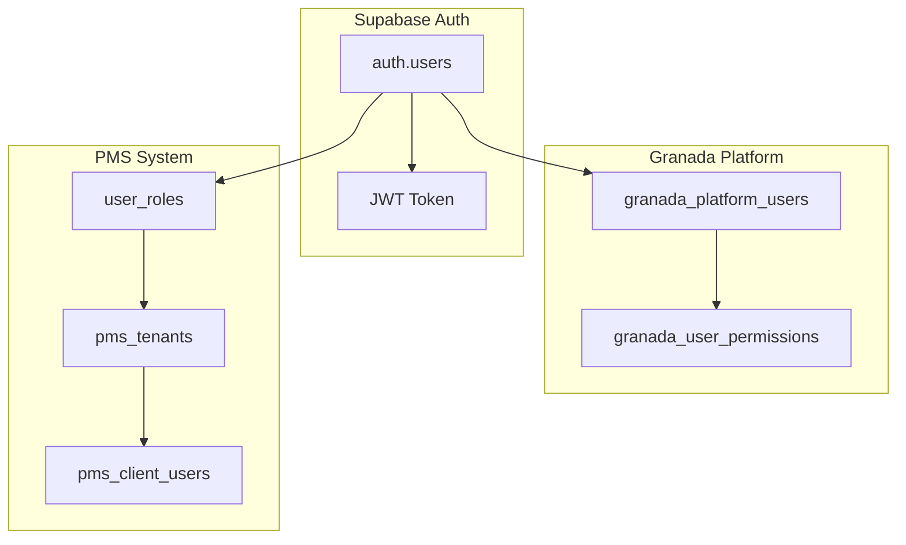
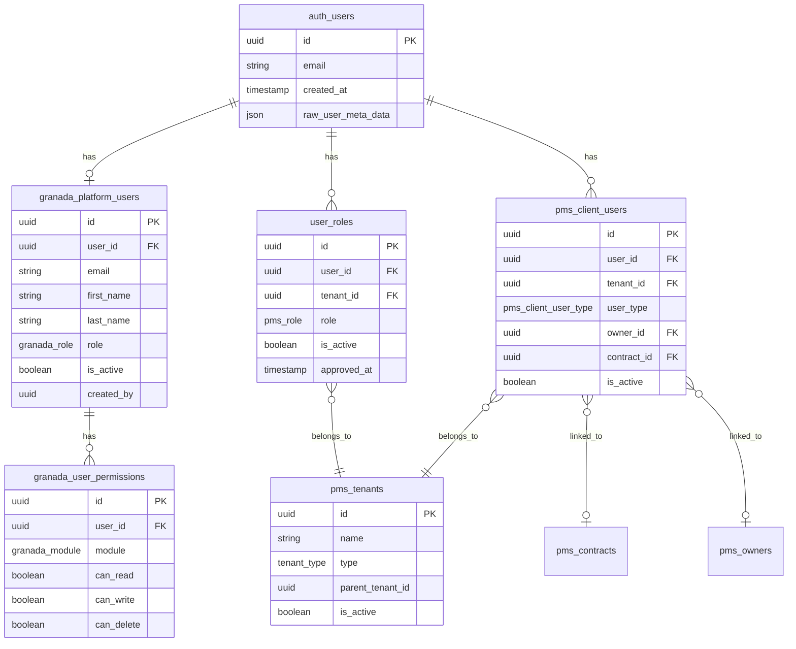
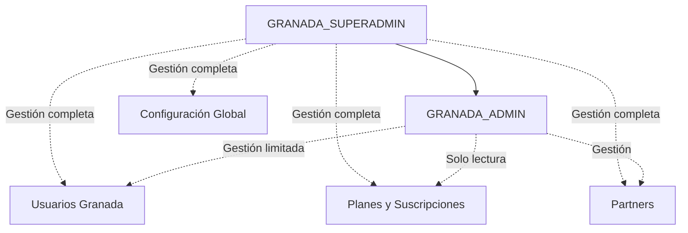
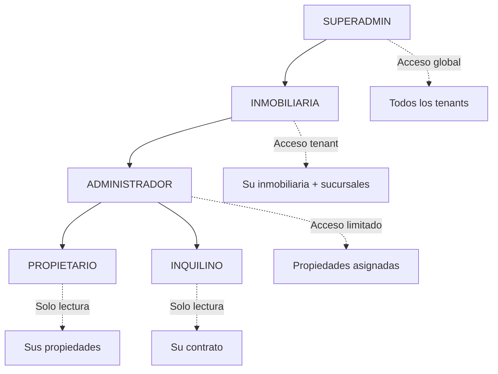
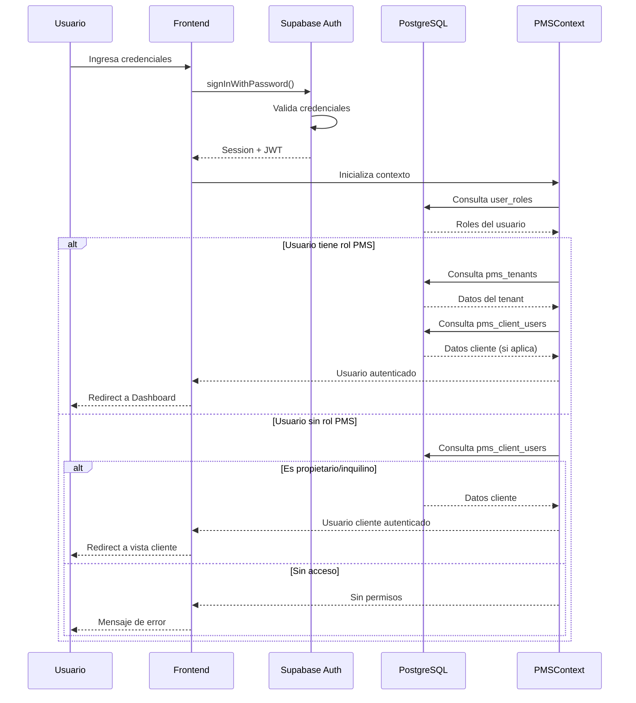
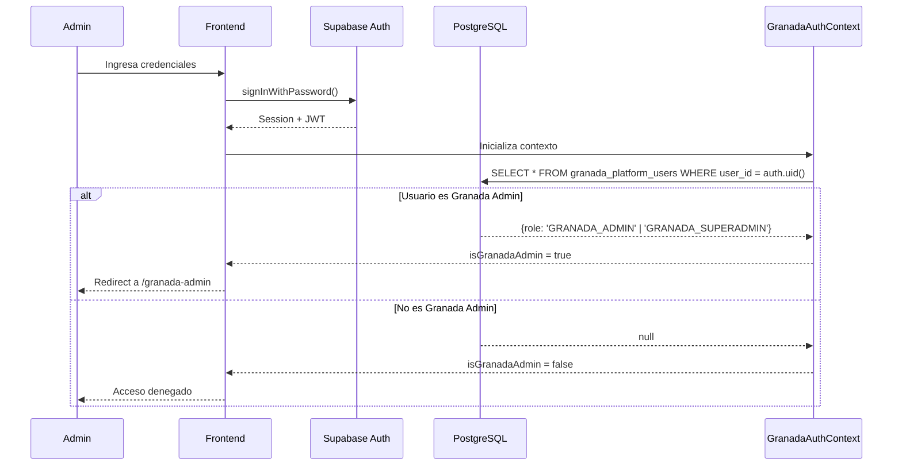
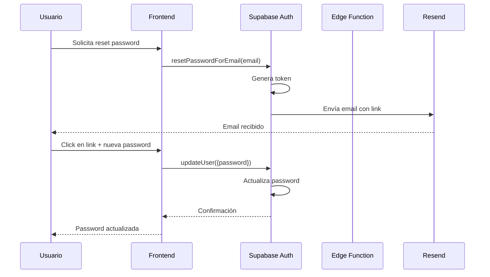
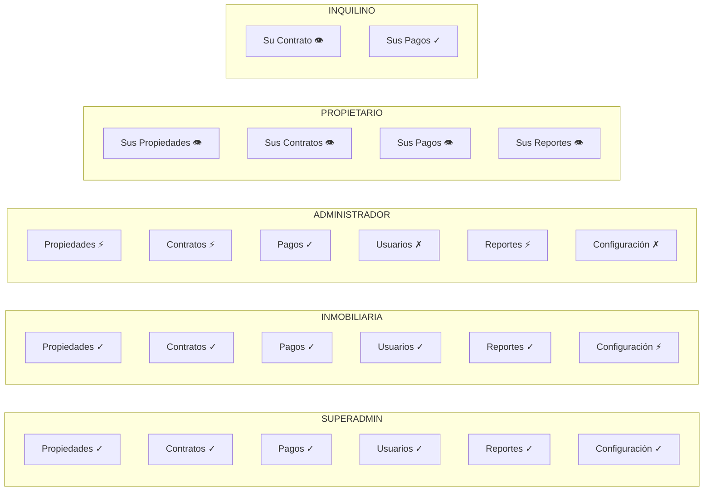
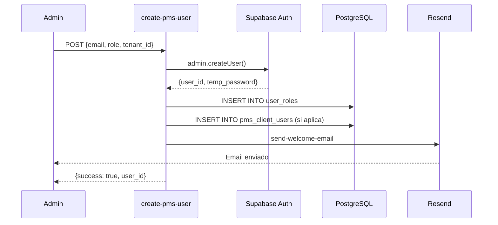
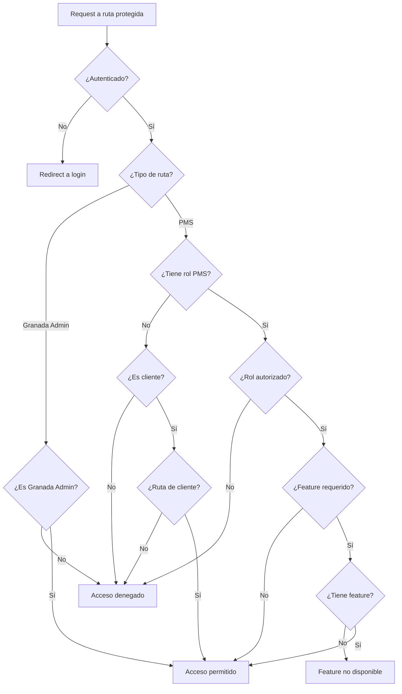

# Sistema de Autenticación y Roles - Granada Platform

## Índice
1. [Visión General](#visión-general)
2. [Arquitectura de Autenticación](#arquitectura-de-autenticación)
3. [Modelo de Datos](#modelo-de-datos)
4. [Jerarquía de Roles](#jerarquía-de-roles)
5. [Flujos de Autenticación](#flujos-de-autenticación)
6. [Protección de Rutas](#protección-de-rutas)
7. [Sistema de Permisos](#sistema-de-permisos)
8. [Funciones SQL de Seguridad](#funciones-sql-de-seguridad)
9. [Edge Functions](#edge-functions)
10. [Buenas Prácticas Implementadas](#buenas-prácticas-implementadas)

---

## Visión General

Granada Platform implementa un sistema de autenticación multinivel que soporta:

- **Usuarios de Granada Platform**: Administradores de la plataforma (SUPERADMIN, ADMIN)
- **Usuarios PMS**: Usuarios del Property Management System con roles jerárquicos
- **Usuarios Cliente**: Propietarios e inquilinos con acceso limitado



---

## Arquitectura de Autenticación

### Capas del Sistema

```
┌─────────────────────────────────────────────────────────────┐
│                    Frontend (React)                          │
├─────────────────────────────────────────────────────────────┤
│  AuthContext │ UserProfileContext │ GranadaAuthContext │ PMSContext
├─────────────────────────────────────────────────────────────┤
│              Supabase Client (@supabase/supabase-js)        │
├─────────────────────────────────────────────────────────────┤
│                    Supabase Auth                             │
├─────────────────────────────────────────────────────────────┤
│           PostgreSQL + RLS Policies                          │
└─────────────────────────────────────────────────────────────┘
```

### Contextos React

| Contexto | Ubicación | Responsabilidad |
|----------|-----------|-----------------|
| `AuthContext` | `src/contexts/AuthContext.tsx` | Autenticación base Supabase |
| `UserProfileContext` | `src/contexts/UserProfileContext.tsx` | Perfil unificado del usuario |
| `GranadaAuthContext` | `src/contexts/GranadaAuthContext.tsx` | Roles Granada Platform |
| `PMSContext` | `src/contexts/PMSContext.tsx` | Contexto PMS (tenant, rol, permisos) |

---

## Modelo de Datos

### Diagrama Entidad-Relación



### Tablas Principales

#### `granada_platform_users`
Usuarios administradores de la plataforma Granada.

```sql
CREATE TABLE granada_platform_users (
    id UUID PRIMARY KEY DEFAULT gen_random_uuid(),
    user_id UUID NOT NULL REFERENCES auth.users(id),
    email TEXT NOT NULL,
    first_name TEXT NOT NULL,
    last_name TEXT NOT NULL,
    role granada_role NOT NULL, -- 'GRANADA_SUPERADMIN' | 'GRANADA_ADMIN'
    is_active BOOLEAN DEFAULT true,
    created_by UUID,
    created_at TIMESTAMPTZ DEFAULT now()
);
```

#### `user_roles`
Roles de usuarios en el sistema PMS.

```sql
CREATE TABLE user_roles (
    id UUID PRIMARY KEY DEFAULT gen_random_uuid(),
    user_id UUID NOT NULL REFERENCES auth.users(id),
    tenant_id UUID REFERENCES pms_tenants(id),
    role pms_role NOT NULL,
    is_active BOOLEAN DEFAULT true,
    approved_at TIMESTAMPTZ,
    approved_by UUID,
    created_at TIMESTAMPTZ DEFAULT now()
);
```

#### `pms_client_users`
Usuarios finales (propietarios e inquilinos).

```sql
CREATE TABLE pms_client_users (
    id UUID PRIMARY KEY DEFAULT gen_random_uuid(),
    user_id UUID NOT NULL REFERENCES auth.users(id),
    tenant_id UUID NOT NULL REFERENCES pms_tenants(id),
    user_type pms_client_user_type NOT NULL, -- 'propietario' | 'inquilino'
    email TEXT NOT NULL,
    first_name TEXT,
    last_name TEXT,
    owner_id UUID REFERENCES pms_owners(id),
    contract_id UUID REFERENCES pms_contracts(id),
    is_active BOOLEAN DEFAULT true,
    created_at TIMESTAMPTZ DEFAULT now()
);
```

---

## Jerarquía de Roles

### Roles Granada Platform



| Rol | Descripción | Permisos |
|-----|-------------|----------|
| `GRANADA_SUPERADMIN` | Super administrador | Acceso total a la plataforma |
| `GRANADA_ADMIN` | Administrador | Gestión de partners, contactos, soporte |

### Roles PMS



| Rol | Nivel | Descripción | Scope |
|-----|-------|-------------|-------|
| `SUPERADMIN` | Sistema | Administrador global | Todos los tenants |
| `INMOBILIARIA` | Tenant | Dueño de inmobiliaria | Su tenant y sub-tenants |
| `ADMINISTRADOR` | Tenant | Empleado administrativo | Propiedades asignadas |
| `PROPIETARIO` | Cliente | Dueño de propiedades | Sus propiedades |
| `INQUILINO` | Cliente | Arrendatario | Su contrato |

---

## Flujos de Autenticación

### Login PMS



### Login Granada Admin



### Recuperación de Contraseña



---

## Protección de Rutas

### Componentes de Protección

```mermaid
graph TD
    subgraph "Rutas Públicas"
        A[/login]
        B[/reset-password]
        C[/granada-platform/*]
    end
    
    subgraph "Rutas WM Admin"
        D[ProtectedRoute]
        D --> E[/admin/*]
    end
    
    subgraph "Rutas Granada Admin"
        F[GranadaProtectedRoute]
        F --> G[/granada-admin/*]
    end
    
    subgraph "Rutas PMS"
        H[PMSPageWrapper]
        H --> I[/pms/*]
    end
```

### `ProtectedRoute`
Protege rutas del panel WM Admin.

```typescript
// src/components/ProtectedRoute.tsx
export function ProtectedRoute({ children }: ProtectedRouteProps) {
  const { user, loading } = useAuth();
  const [userProfile, setUserProfile] = useState<UserProfile | null>(null);

  useEffect(() => {
    if (user) {
      // Consulta perfil desde user_profiles
      supabase
        .from('user_profiles')
        .select('role, status')
        .eq('user_id', user.id)
        .single()
        .then(({ data }) => setUserProfile(data));
    }
  }, [user]);

  if (loading) return <Loader />;
  if (!user) return <Navigate to="/auth" />;
  if (userProfile?.status === 'pending') return <PendingMessage />;
  if (userProfile?.status === 'denied') return <DeniedMessage />;
  if (!['admin', 'superadmin'].includes(userProfile?.role)) {
    return <Navigate to="/" />;
  }

  return <>{children}</>;
}
```

### `GranadaProtectedRoute`
Protege rutas del panel Granada Admin.

```typescript
// src/components/GranadaProtectedRoute.tsx
export function GranadaProtectedRoute({ children }: Props) {
  const { user, isGranadaAdmin, loading } = useGranadaAuth();

  if (loading) return <Loader />;
  if (!user) return <Navigate to="/granada-admin/login" />;
  if (!isGranadaAdmin) return <AccessDeniedCard />;

  return <>{children}</>;
}
```

### `PMSPageWrapper`
Protege rutas del sistema PMS con verificación de permisos.

```typescript
// src/components/pms/PMSPageWrapper.tsx
export function PMSPageWrapper({ 
  children, 
  requiredRoles,
  requiredFeature 
}: Props) {
  const { userRole, tenant, loading } = usePMS();
  const { hasFeature } = useSubscriptionFeatures();

  if (loading) return <PMSLoader />;
  
  // Verificar rol
  if (requiredRoles && !requiredRoles.includes(userRole)) {
    return <AccessDenied />;
  }
  
  // Verificar feature de suscripción
  if (requiredFeature && !hasFeature(requiredFeature)) {
    return <FeatureNotAvailable feature={requiredFeature} />;
  }

  return <>{children}</>;
}
```

### Matriz de Acceso por Ruta

| Ruta | Componente Protector | Roles Permitidos |
|------|---------------------|------------------|
| `/admin/*` | `ProtectedRoute` | admin, superadmin |
| `/granada-admin/*` | `GranadaProtectedRoute` | GRANADA_ADMIN, GRANADA_SUPERADMIN |
| `/pms/properties` | `PMSPageWrapper` | SUPERADMIN, INMOBILIARIA, ADMINISTRADOR |
| `/pms/contracts` | `PMSPageWrapper` | SUPERADMIN, INMOBILIARIA, ADMINISTRADOR |
| `/pms/payments` | `PMSPageWrapper` | SUPERADMIN, INMOBILIARIA, ADMINISTRADOR |
| `/pms/my-contract` | `PMSPageWrapper` | PROPIETARIO, INQUILINO |
| `/pms/users` | `PMSPageWrapper` | SUPERADMIN, INMOBILIARIA |

---

## Sistema de Permisos

### Permisos Granada Platform

```sql
CREATE TYPE granada_module AS ENUM (
    'users',
    'partners', 
    'subscriptions',
    'contacts',
    'analytics',
    'settings'
);

CREATE TABLE granada_user_permissions (
    id UUID PRIMARY KEY DEFAULT gen_random_uuid(),
    user_id UUID REFERENCES auth.users(id),
    module granada_module NOT NULL,
    can_read BOOLEAN DEFAULT false,
    can_write BOOLEAN DEFAULT false,
    can_delete BOOLEAN DEFAULT false,
    granted_by UUID,
    granted_at TIMESTAMPTZ DEFAULT now()
);
```

### Permisos por Rol PMS



**Leyenda**: ✓ = Completo | ⚡ = Limitado | 👁 = Solo lectura | ✗ = Sin acceso

---

## Funciones SQL de Seguridad

### Verificación de Roles

```sql
-- Verifica si usuario tiene rol específico en PMS
CREATE OR REPLACE FUNCTION has_pms_role(
    _user_id UUID, 
    _role pms_role
)
RETURNS BOOLEAN
LANGUAGE sql
STABLE
SECURITY DEFINER
SET search_path = public
AS $$
    SELECT EXISTS (
        SELECT 1 FROM user_roles
        WHERE user_id = _user_id
        AND role = _role
        AND is_active = true
    )
$$;

-- Verifica si es superadmin PMS
CREATE OR REPLACE FUNCTION is_superadmin_pms(_user_id UUID)
RETURNS BOOLEAN
LANGUAGE sql
STABLE
SECURITY DEFINER
SET search_path = public
AS $$
    SELECT EXISTS (
        SELECT 1 FROM user_roles
        WHERE user_id = _user_id
        AND role = 'SUPERADMIN'
        AND is_active = true
    )
$$;

-- Verifica si es Granada Admin
CREATE OR REPLACE FUNCTION is_granada_admin(_user_id UUID)
RETURNS BOOLEAN
LANGUAGE sql
STABLE
SECURITY DEFINER
SET search_path = public
AS $$
    SELECT EXISTS (
        SELECT 1 FROM granada_platform_users
        WHERE user_id = _user_id
        AND role IN ('GRANADA_ADMIN', 'GRANADA_SUPERADMIN')
        AND is_active = true
    )
$$;
```

### Obtener Tenant del Usuario

```sql
CREATE OR REPLACE FUNCTION get_user_tenant_id(_user_id UUID)
RETURNS UUID
LANGUAGE sql
STABLE
SECURITY DEFINER
SET search_path = public
AS $$
    SELECT tenant_id FROM user_roles
    WHERE user_id = _user_id
    AND is_active = true
    LIMIT 1
$$;
```

### Verificar Acceso a Recurso

```sql
CREATE OR REPLACE FUNCTION can_access_property(
    _user_id UUID,
    _property_id UUID
)
RETURNS BOOLEAN
LANGUAGE plpgsql
STABLE
SECURITY DEFINER
SET search_path = public
AS $$
DECLARE
    _user_role pms_role;
    _user_tenant_id UUID;
    _property_tenant_id UUID;
BEGIN
    -- Obtener rol y tenant del usuario
    SELECT role, tenant_id INTO _user_role, _user_tenant_id
    FROM user_roles
    WHERE user_id = _user_id AND is_active = true
    LIMIT 1;
    
    -- Superadmin tiene acceso a todo
    IF _user_role = 'SUPERADMIN' THEN
        RETURN true;
    END IF;
    
    -- Obtener tenant de la propiedad
    SELECT tenant_id INTO _property_tenant_id
    FROM pms_properties
    WHERE id = _property_id;
    
    -- Verificar que pertenece al mismo tenant o sub-tenant
    RETURN _property_tenant_id = _user_tenant_id
        OR EXISTS (
            SELECT 1 FROM pms_tenants
            WHERE id = _property_tenant_id
            AND parent_tenant_id = _user_tenant_id
        );
END;
$$;
```

### Ejemplo de Política RLS

```sql
-- Política para pms_properties
CREATE POLICY "Users can view properties in their tenant"
ON pms_properties
FOR SELECT
USING (
    -- Superadmin ve todo
    is_superadmin_pms(auth.uid())
    OR
    -- Usuario ve propiedades de su tenant
    tenant_id = get_user_tenant_id(auth.uid())
    OR
    -- Usuario ve propiedades de sub-tenants
    tenant_id IN (
        SELECT id FROM pms_tenants
        WHERE parent_tenant_id = get_user_tenant_id(auth.uid())
    )
    OR
    -- Propietario ve sus propiedades
    EXISTS (
        SELECT 1 FROM pms_client_users cu
        JOIN pms_owners o ON cu.owner_id = o.id
        WHERE cu.user_id = auth.uid()
        AND o.id = pms_properties.owner_id
    )
);
```

---

## Edge Functions

### Funciones de Autenticación

| Función | Trigger | Descripción |
|---------|---------|-------------|
| `create-pms-user` | Manual | Crea usuario PMS con rol |
| `create-granada-platform-user` | Manual | Crea usuario Granada Admin |
| `reset-user-password` | Manual | Reset de contraseña administrativo |
| `send-welcome-email` | Post-creación | Email de bienvenida |
| `setup-inmobiliaria-client-admin` | Aprobación suscripción | Configura admin de inmobiliaria |
| `auto-create-propietario-user` | Activación contrato | Crea usuario propietario |
| `auto-create-inquilino-user` | Activación contrato | Crea usuario inquilino |

### Flujo de Creación de Usuario PMS



---

## Buenas Prácticas Implementadas

### ✅ Seguridad

1. **Roles en tabla separada**: Nunca en `auth.users` o `profiles`
2. **SECURITY DEFINER**: Funciones que verifican roles evitan recursión RLS
3. **JWT no manipulable**: Roles verificados server-side, no en localStorage
4. **Multi-tenant isolation**: RLS por `tenant_id` en todas las tablas
5. **Passwords temporales**: Forzar cambio en primer login

### ✅ Arquitectura

1. **Contextos separados**: Separación de concerns por dominio
2. **Hooks reutilizables**: `useSubscriptionFeatures`, `useSubscriptionLimits`
3. **Componentes de protección**: Wrapper pattern para rutas
4. **Verificación en cascada**: Auth → Rol → Permisos → Feature

### ✅ UX

1. **Loading states**: Indicadores claros durante verificación
2. **Mensajes de error**: Específicos por tipo de denegación
3. **Redirección inteligente**: Según rol y estado del usuario

---

## Puntos de Atención

### ⚠️ Mejoras Pendientes

| Área | Descripción | Prioridad |
|------|-------------|-----------|
| 2FA | Implementar autenticación de dos factores | Alta |
| Session timeout | Configurar expiración de sesión | Media |
| Audit log | Log de acciones de autenticación | Media |
| Rate limiting | Limitar intentos de login | Alta |
| IP whitelist | Para cuentas administrativas | Baja |

### ⚠️ Deuda Técnica

1. **Unificar contextos**: Considerar un único `AuthContext` completo
2. **Caché de permisos**: Evitar consultas repetidas a la BD
3. **Refresh token**: Implementar renovación automática
4. **Error boundaries**: Manejo de errores de auth a nivel de app

---

## Componentes UI

### Gestión de Usuarios

```
src/components/
├── granada/
│   └── PlatformUsersManagement.tsx  # Usuarios Granada Platform
├── pms/
│   ├── PropietarioUsersManagement.tsx  # Usuarios propietarios
│   └── InviteCollaboratorDialog.tsx    # Invitar colaboradores
├── WMAdminUsersManagement.tsx          # Usuarios WM Admin
└── UserApprovals.tsx                   # Aprobación de accesos
```

### Páginas de Auth

```
src/pages/
├── Auth.tsx                # Login WM
├── PMSLogin.tsx           # Login PMS
├── PMSResetPassword.tsx   # Reset password PMS
├── GranadaAdminLogin.tsx  # Login Granada Admin
├── GranadaResetPassword.tsx  # Reset Granada
└── GranadaChangePassword.tsx # Cambio de password
```

---

## Diagrama de Decisión de Acceso



---

## Recomendaciones

### Corto Plazo
- [ ] Implementar rate limiting en endpoints de auth
- [ ] Agregar logs de auditoría para acciones de autenticación
- [ ] Configurar session timeout apropiado

### Mediano Plazo
- [ ] Implementar 2FA opcional
- [ ] Crear dashboard de sesiones activas
- [ ] Implementar "forgot password" con verificación adicional

### Largo Plazo
- [ ] Integrar SSO para clientes enterprise
- [ ] Implementar RBAC más granular
- [ ] Agregar OAuth providers (Google, Microsoft)

---

*Documento generado: Diciembre 2024*
*Versión: 1.0*
